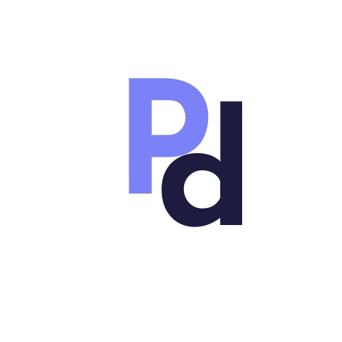
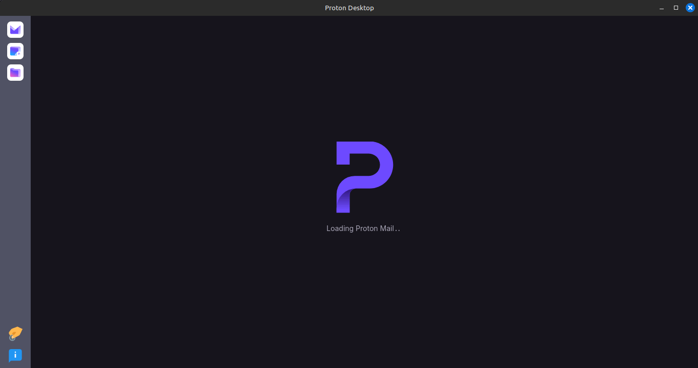
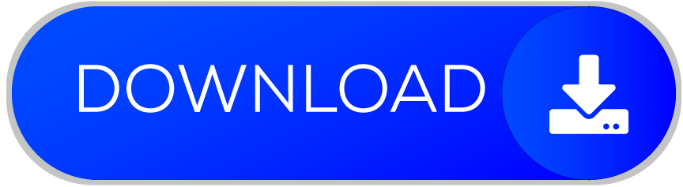

  

<h1 align="center">Protodesk</h1>

Unofficial desktop app for Proton

  

## About

**Protodesk** is a free open-source desktop app for Proton. It brings together Proton Mail, Proton 
Calendar, and Proton Drive into a single Linux application. While Proton (the awesome company behind these
wonderful services) has been working to release desktop apps for the same, they are distinct for each
service and only fully available to premium users beyond the 14-day trial period.

**Protodesk** therefore enables users to:
- use Proton services without having to install 3 different apps for 3 different services all of which use
  a unified account.
- access the 3 core Proton services (Mail, Calendar, and Drive) without having to visit the websites on
  their browsers.

## Download

Notably, **Protodesk** is only available for Linux distributions as an AppImage, and there are *currently*
no plans to make it available for other platforms.

  

## Contributions

Contributions are much welcome! Feel free to open an issue or create a pull request.

To create a pull request:
1. Fork this repository and clone it to your local machine.
2. Create a new branch for your changes (features, bug fixes, etc.)
3. Make your changes and commit them with [a clear commit message](https://www.freecodecamp.org/news/how-to-write-better-git-commit-messages/).
4. Open a pull request with a detailed description of your changes.

## Donations

If you like the idea behind the project and would like to financially support its continued development 
and maintenance, you are welcome to do so using any of these channels:

    
    &nbsp;&nbsp;&nbsp;&nbsp;&nbsp;&nbsp;
    

## Developers & Maintainers

Nemuel Wainaina - [nemuelwainaina@proton.me](mailto:nemuelwainaina@proton.me)
