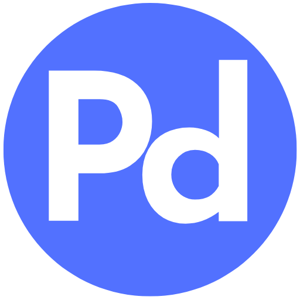

  

<h1 align="center">Proton Desktop</h1>

Unofficial desktop app for Proton

## About

**Proton Desktop** is a free open-source desktop app for Proton. It brings together Proton Mail, Proton 
Calendar, and Proton Drive into a single Linux application. While Proton (the awesome company behind these
wonderful services) has been working to release desktop apps for the same, they are distinct for each
service and only fully available to premium users beyond the 14-day trial period.

**Proton Desktop** therefore enables users to:
- use Proton services without having to install 3 different apps for 3 different services all of which use
  a unified account.
- access the 3 core Proton services (Mail, Calendar, and Drive) without having to visit the websites on
  their browsers.

## Contributions

Contributions are much welcome! Feel free to open an issue or create a pull request.

## Donations

If you like the idea behind the project and would like to financially support its continued development 
and maintenance, you are welcome to do so using any of these channels:

    
    &nbsp;&nbsp;&nbsp;&nbsp;&nbsp;&nbsp;
    

## Developers & Maintainers

1. Nemuel Wainaina
   - **Email**: [nemuelwainaina@proton.me](mailto:nemuelwainaina@proton.me)
